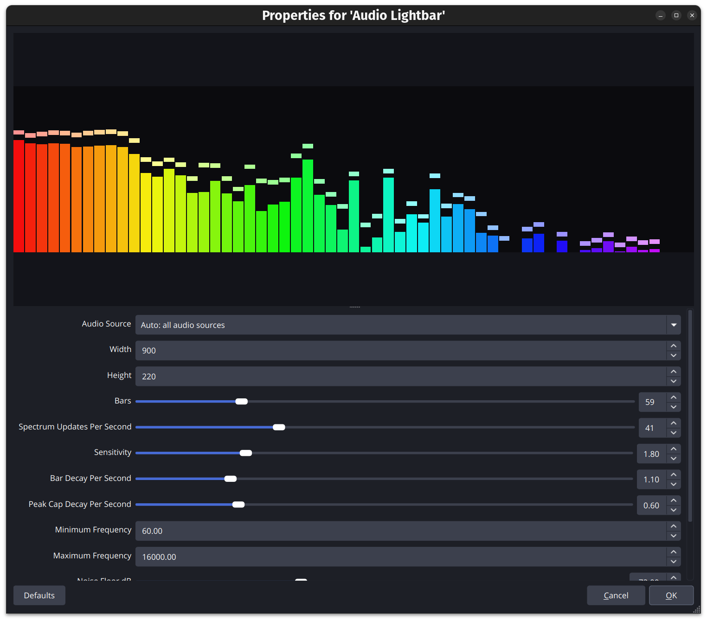

# Audio Lightbar OBS Plugin

Native OBS source plugin that draws a lightweight rainbow spectrum lightbar for
audio currently playing in OBS. Add it to a scene as `Audio Lightbar`, similar
to an old Winamp-style visualizer.

## Preview



## Features

- Auto mode listens to all current OBS audio sources while the visualizer is
  visible.
- Optional specific audio source selection.
- Log-spaced frequency bands, defaulting to 60 Hz through 5 kHz.
- `Stacked Brick` render style by default, with an optional `Smooth` original
  bar style.
- Scene resizing updates the source width, height, and aspect ratio by default.
- Lightweight Goertzel spectrum analysis with fixed-size buffers: no per-frame
  heap allocation and no retained audio buffers.
- Configurable render style, bar count, brick rows, update rate, sensitivity,
  decay, peak caps, mirror mode, frequency range, outside-range handling, noise
  floor, rainbow order/orientation, width, height, and scene resize behavior.
- Analyzes at most 1024 samples per audio update, keeping CPU use bounded even
  with high channel counts.

## Build

Linux dependencies:

- OBS Studio development files (`libobs` headers and library)
- SIMDe headers (`libsimde-dev` on Debian/Ubuntu/Pop!_OS)
- CMake 3.16+
- A C17 compiler

On Debian/Ubuntu/Pop!_OS, install the default dependency set with:

```sh
make deps
```

If your distro separates OBS headers from the OBS app, install that development
package too, for example `libobs-dev`.

Build:

```sh
make build
```

The plugin binary will be `build/audio-lightbar.so`.

Build and install for the current OBS user profile:

```sh
make install
```

## Install

### User install on Linux

Close OBS, then copy the built plugin into OBS' user plugin directory:

```sh
make install-user
```

Start OBS again.

### System install on Linux

If your OBS install loads plugins from `/usr/lib/x86_64-linux-gnu/obs-plugins`,
you can install system-wide with:

```sh
make install-system
```

For distributions using a different OBS plugin directory, copy
`build/audio-lightbar.so` into that directory.

## Usage

1. Open OBS and choose `Sources` -> `+` -> `Audio Lightbar`.
2. Leave `Audio Source` as `Auto: all audio sources` to visualize whatever OBS is
   currently playing, or choose a specific source.
3. Resize the source directly in the OBS scene preview. With `Resize
   Width/Height From Scene Transform` enabled, dragging the scene item updates
   the lightbar's real width and height; non-uniform resizing changes its aspect
   ratio. Use the `Width` and `Height` fields for an initial or exact numeric
   size.
4. Choose `Render Style`: `Stacked Brick` is the default, and `Smooth` restores
   the original continuous bars.
5. Adjust `Bars`, `Brick Rows`, `Spectrum Updates Per Second`, and
   `Sensitivity` if needed. `Brick Rows` is configurable from `10` to `100`.
6. Use `Lowest Frequency (default: 60 Hz)` and `Highest Frequency (default:
   5 kHz)` to choose which spectrum range fills the bars. Raise `Highest
   Frequency` if you want more high-frequency music detail.
7. By default, frequencies below `Lowest Frequency` feed the first bar and
   frequencies above `Highest Frequency` feed the last bar. Enable
   `Ignore Outside Frequency Range` to discard those outside frequencies
   instead.
8. Enable `Reverse Rainbow Order` for violet-to-red, or `Vertical Rainbow` to
   color bricks by height instead of left-to-right position.

If the bars are still too short, raise `Sensitivity` or move `Noise Floor dB`
closer to zero, for example from `-72` to `-60`. Lower `Bars` and
`Spectrum Updates Per Second` if you want the lowest possible CPU use. The
bars are drawn as brick segments based on the source width and height; resizing
the OBS scene item updates that brick area when scene resize sync is enabled.

## Frequency Notes

Human hearing is roughly `20 Hz` to `20 kHz`, but speech and stream audio usually
look more useful with a narrower visual range. Human speech fundamentals are
commonly around `85 Hz` to `255 Hz`, while much of speech clarity sits from a few
hundred hertz up to about `4 kHz`; the default `60 Hz` to `5 kHz` range keeps the
bars focused on that active area.

The bars are split on a logarithmic scale, so each step represents a frequency
ratio instead of a fixed number of hertz. That gives roughly even visual space
per octave. By default, frequencies below the selected range are folded into the
first bar and frequencies above the selected range are folded into the last bar.
Enable `Ignore Outside Frequency Range` if you want those outside frequencies to
be discarded instead.
